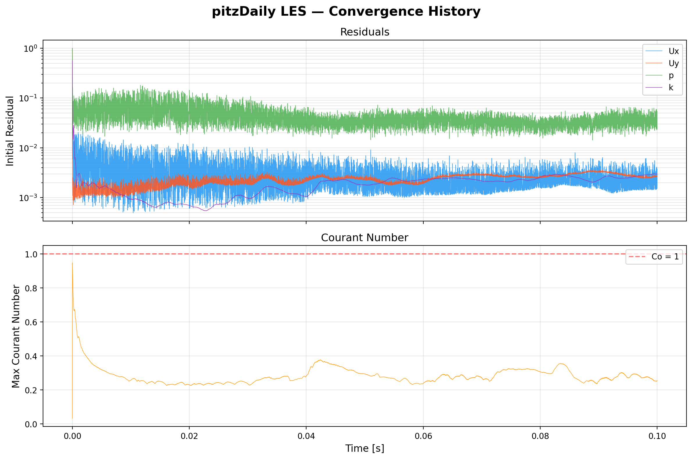
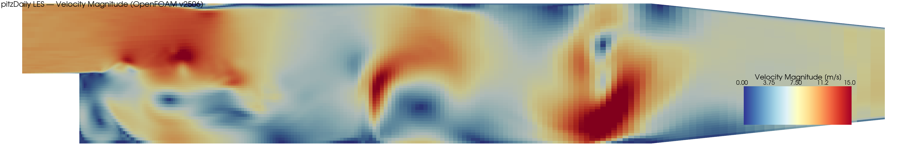
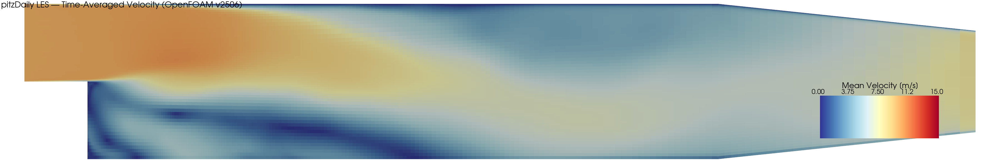

# pitzDaily LES — Backward-Facing Step (OpenFOAM v2506)

Large Eddy Simulation of turbulent flow over a backward-facing step using the pitzDaily geometry. This benchmark case demonstrates LES with the dynamic k-equation SGS model in OpenFOAM v2506.


## Case Description

| Parameter | Value |
|---|---|
| **Geometry** | Pitz-Daily backward-facing step |
| **Step height (h)** | 25.4 mm |
| **Inlet velocity** | 10 m/s |
| **Reynolds number (Re_h)** | 25,400 |
| **Turbulence model** | LES — Dynamic k-equation (dynamicKEqn) |
| **Solver** | pisoFoam |
| **Mesh cells** | 12,225 |
| **Time step (dt)** | 1e-05 s |
| **End time** | 0.1 s (10,000 timesteps) |
| **Execution time** | ~559 s (single core) |

## Results

### Convergence History



Residuals remain bounded and oscillatory — characteristic of LES (no steady state). The max Courant number stays well below 1 throughout.

### Instantaneous Velocity Field (t = 0.1 s)



The instantaneous velocity field shows resolved turbulent eddies downstream of the step, with a clear recirculation zone immediately behind the step edge.

### Time-Averaged Velocity Field



The time-averaged velocity shows the mean recirculation zone behind the step. Longer averaging (more flow-through times) would sharpen the reattachment region.

### Final Simulation Metrics

| Metric | Value |
|---|---|
| Final Ux residual | 1.71e-03 |
| Final Uy residual | 2.63e-03 |
| Final p residual | 3.92e-02 |
| Final k residual | 2.98e-03 |
| Final max Courant | 0.254 |
| Mean max Courant | 0.284 |
| Reattachment x/h (mean) | ~1.7 (under-developed; literature ≈ 6–7) |

> **Note:** The reattachment length is shorter than experimental values because 0.1 s provides only ~4 flow-through times. LES requires O(10–20) flow-through times for converged statistics. This is a demonstration case, not a validation study.

## How to Run

### Prerequisites
- OpenFOAM v2506 (ESI/OpenCFD)
- Python 3.x with `pyvista`, `matplotlib`, `numpy`, `Pillow` (for post-processing)

### Run the simulation
```bash
source /usr/lib/openfoam/openfoam2506/etc/bashrc
cd pitzDaily-LES
blockMesh
pisoFoam
```

### Generate plots
```bash
python scripts/plot_convergence.py
python scripts/plot_contour.py
python scripts/generate_gif.py
```

## File Structure

```
pitzDaily-LES/
├── 0/                          # Initial conditions (U, p, k, nut, nuTilda)
├── constant/
│   ├── transportProperties     # nu = 1e-05 m²/s
│   └── turbulenceProperties    # LES, dynamicKEqn
├── system/
│   ├── blockMeshDict           # 12,225 cell structured mesh
│   ├── controlDict             # pisoFoam, dt=1e-05, endTime=0.1
│   ├── fvSchemes               # backward (time), LUST (convection)
│   └── fvSolution              # GAMG (p), smoothSolver (U, k)
├── scripts/
│   ├── plot_convergence.py     # Residual & Courant plots
│   ├── plot_contour.py         # Velocity contour + reattachment
│   └── generate_gif.py         # Animated GIF from all timesteps
├── images/
│   ├── convergence_plot.png
│   ├── velocity_contour.png
│   ├── mean_velocity_contour.png
│   ├── velocity_animation.gif
│   └── velocity_animation_web.gif
├── Allrun
└── Allclean
```

## References

- Pitz, R.W., Daily, J.W. (1983). "Combustion in a turbulent mixing layer formed at a rearward-facing step." *AIAA Journal*, 21(11), 1565–1570.
- OpenFOAM v2506 Tutorial: `$FOAM_TUTORIALS/incompressible/pisoFoam/LES/pitzDaily`
